```mermaid
flowchart LR
    subgraph Validate["✅ Validate"]
        V1["Checkout"] --> V2["Setup Terraform"]
        V2 --> V3["Format Check"]
        V3 --> V4["AWS Credentials"]
        V4 --> V5["terraform init"]
        V5 --> V6["terraform validate"]
    end
    
    subgraph Plan["📋 Plan"]
        P1["Checkout"] --> P2["Setup Terraform"]
        P2 --> P3["AWS Credentials"]
        P3 --> P4["terraform init"]
        P4 --> P5["terraform plan"]
        P5 --> P6["Upload Plan Artifact"]
    end
    
    subgraph Apply["🚀 Apply"]
        A1["Checkout"] --> A2["Setup Terraform"]
        A2 --> A3["AWS Credentials"]
        A3 --> A4["Download Plan"]
        A4 --> A5["terraform init"]
        A5 --> A6["terraform apply"]
        A6 --> A7["Output URLs"]
    end
    
    Validate --> Plan
    Plan --> |"main branch only"| Apply
```

```mermaid
flowchart LR
    subgraph Test["🧪 Test"]
        T1["Checkout"] --> T2["Setup Python 3.12"]
        T2 --> T3["Install Dependencies"]
        T3 --> T4["Verify Imports"]
    end
    
    subgraph Build["📦 Build"]
        B1["Checkout"] --> B2["Setup Python 3.12"]
        B2 --> B3["Create Package"]
        B3 --> B4["Upload lambda.zip"]
    end
    
    subgraph Deploy["🚀 Deploy"]
        D1["Download Artifact"] --> D2["AWS Credentials"]
        D2 --> D3["Update Lambda"]
        D3 --> D4["Wait for Update"]
        D4 --> D5["Smoke Test"]
    end
    
    Test --> Build
    Build --> |"main branch only"| Deploy
```

```mermaid
flowchart LR
    subgraph Build["📦 Build"]
        B1["Checkout"] --> B2["Setup Node.js 20"]
        B2 --> B3["npm ci"]
        B3 --> B4["npm run lint"]
        B4 --> B5["npm run build"]
        B5 --> B6["Upload dist/"]
    end
    
    subgraph Deploy["🚀 Deploy"]
        D1["Download Artifact"] --> D2["AWS Credentials"]
        D2 --> D3["Sync to S3"]
        D3 --> D4["Invalidate CloudFront"]
        D4 --> D5["Output URL"]
    end
    
    Build --> |"main branch only"| Deploy
```

# GitHub Actions CI/CD Flow

This document explains the complete CI/CD pipeline for the Credit Risk Underwriting Assistant.

## Overview

---

## 1. Terraform Workflow

**File:** `.github/workflows/terraform.yml`

Manages AWS infrastructure provisioning for the entire application.

### Trigger Conditions

| Event | Condition |
|-------|-----------|
| Push | `main` branch + changes in `infra/**` |
| Pull Request | `main` branch + changes in `infra/**` |
| Manual | `workflow_dispatch` |

### Job Flow

### Job Details

#### Job 1: Validate
- **Purpose:** Ensure Terraform code is properly formatted and syntactically correct
- **Steps:**
  1. Checkout code
  2. Setup Terraform v1.6
  3. Run `terraform fmt -check -recursive`
  4. Configure AWS credentials
  5. Run `terraform init`
  6. Run `terraform validate`

#### Job 2: Plan
- **Depends on:** Validate
- **Purpose:** Generate an execution plan showing what changes will be made
- **Steps:**
  1. Checkout code
  2. Setup Terraform v1.6
  3. Configure AWS credentials
  4. Run `terraform init`
  5. Run `terraform plan` with secrets
  6. Upload plan as artifact (7 days retention)

#### Job 3: Apply
- **Depends on:** Plan
- **Condition:** Only runs on `main` branch push events
- **Environment:** `production`
- **Purpose:** Apply infrastructure changes
- **Steps:**
  1. Checkout code
  2. Setup Terraform v1.6
  3. Configure AWS credentials
  4. Download plan artifact
  5. Run `terraform init`
  6. Run `terraform apply -auto-approve tfplan`
  7. Output API Gateway and CloudFront URLs

---

## 2. Deploy Backend Workflow

**File:** `.github/workflows/deploy-backend.yml`

Builds and deploys the Python FastAPI backend to AWS Lambda.

### Trigger Conditions

| Event | Condition |
|-------|-----------|
| Push | `main` branch + changes in `src/backend/**` |
| Manual | `workflow_dispatch` |

### Job Flow

### Job Details

#### Job 1: Test
- **Purpose:** Validate Python code and dependencies
- **Steps:**
  1. Checkout code
  2. Setup Python 3.12
  3. Install dependencies (`pip install -e .`)
  4. Verify imports work for FastAPI app and Lambda handler

#### Job 2: Build
- **Depends on:** Test
- **Purpose:** Create Lambda deployment package
- **Steps:**
  1. Checkout code
  2. Setup Python 3.12
  3. Create package directory with dependencies
  4. Copy `app/` and `lambda_handler.py`
  5. Create `lambda.zip`
  6. Upload as artifact (7 days retention)

#### Job 3: Deploy
- **Depends on:** Build
- **Condition:** Only runs on `main` branch
- **Environment:** `production`
- **Purpose:** Deploy to AWS Lambda
- **Steps:**
  1. Download `lambda.zip` artifact
  2. Configure AWS credentials
  3. Update Lambda function code
  4. Wait for update to complete
  5. Run smoke test against health endpoint

---

## 3. Deploy Frontend Workflow

**File:** `.github/workflows/deploy-frontend.yml`

Builds and deploys the React/Vite frontend to S3 + CloudFront.

### Trigger Conditions

| Event | Condition |
|-------|-----------|
| Push | `main` branch + changes in `src/frontend/**` |
| Manual | `workflow_dispatch` |

### Job Flow

### Job Details

#### Job 1: Build
- **Purpose:** Build production-ready frontend assets
- **Steps:**
  1. Checkout code
  2. Setup Node.js 20 with npm cache
  3. Install dependencies (`npm ci`)
  4. Run linting (`npm run lint`)
  5. Build with API URL (`npm run build`)
  6. Upload `dist/` as artifact (7 days retention)

#### Job 2: Deploy
- **Depends on:** Build
- **Condition:** Only runs on `main` branch
- **Environment:** `production`
- **Purpose:** Deploy to S3 and invalidate CloudFront cache
- **Steps:**
  1. Download build artifact
  2. Configure AWS credentials
  3. Sync files to S3 with cache headers:
     - Static assets: `max-age=31536000` (1 year)
     - `index.html`: `no-cache`
  4. Invalidate CloudFront distribution
  5. Output deployment URL

---

## Required Repository Secrets

| Secret | Used By | Description |
|--------|---------|-------------|
| `AWS_ACCESS_KEY_ID` | All | AWS IAM access key |
| `AWS_SECRET_ACCESS_KEY` | All | AWS IAM secret key |
| `GEMINI_API_KEY` | Terraform | Gemini AI API key |
| `GEMINI_MODEL_NAME` | Terraform | Gemini model name (e.g., gemini-2.0-flash) |
| `API_GATEWAY_URL` | Frontend | Backend API endpoint |
| `S3_BUCKET_NAME` | Frontend | Frontend hosting bucket |
| `CLOUDFRONT_DISTRIBUTION_ID` | Frontend | CDN distribution ID |
| `CLOUDFRONT_DOMAIN` | Frontend | CDN domain for output |

---

## Complete Deployment Architecture

---

## Path-Based Trigger Summary

| Changed Files | Triggered Workflow |
|---------------|-------------------|
| `infra/**` | Terraform |
| `src/backend/**` | Deploy Backend |
| `src/frontend/**` | Deploy Frontend |
| `.github/workflows/terraform.yml` | Terraform |
| `.github/workflows/deploy-backend.yml` | Deploy Backend |
| `.github/workflows/deploy-frontend.yml` | Deploy Frontend |
